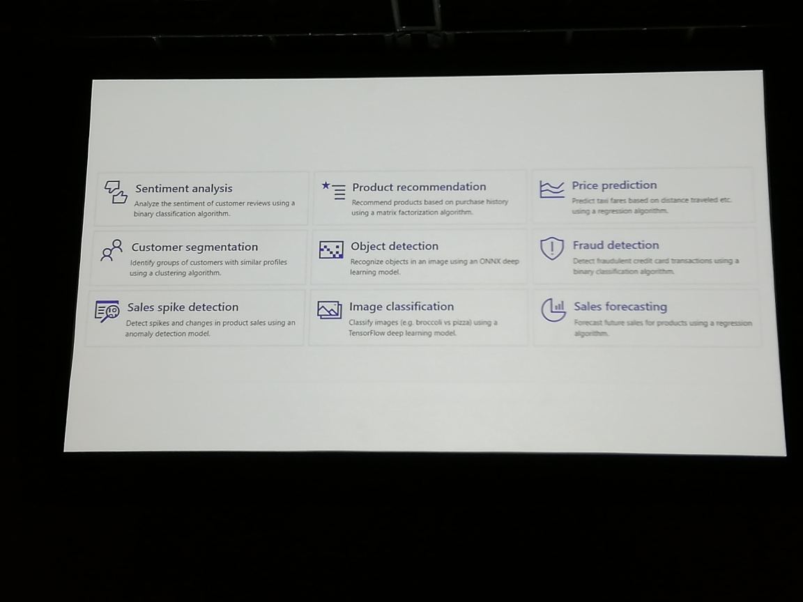
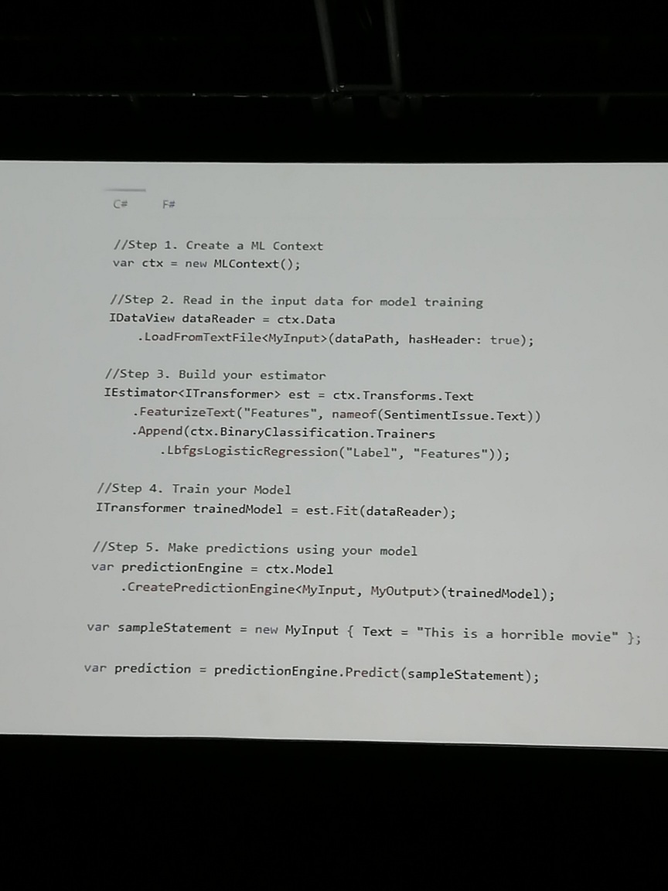

# "leap of faith" - AI for .net

# we process a lot of data these days ...

"intelligence becomes affordable for biz apps"

same slide as another talk *the data science process*
  including the "in dev terms"
  _does this guy work at the same company??(solliance)_
  yep ... works at solliance ...

same spectrum slide too

lots of opportunities in the Data Science field, so we're all going to be rich.

you don't have to learn R, scala, python thanks to ONNX
  MS is one of the drivers behind ONNX (not a coincidence)

ML.net covers most of the workloads

See photo for different categories such as *sales forecasting* and *fraud detection*

fraudulent transactions are a very small % of all transactions
ML.net wouldn't produce a perfect model, but it would still be pretty good, and comparable to what a python coder would make

see photo for code sample of trainig and making predictions

scm, devops, testing more important than raw data science skills
  data scientists don't typically work in a structured way .... 
  most data scientists aren't "equipped" to handle normal SDLC

this talk was 99% .... pretty useless ...

the ai talks are all either very high level or better level but way too fast

## question - how easy is it to hide malignant info in all that massive data?
yes, it's a big problem

## question - how to interview a data scientis? top 2 questions?
 - Not technical
 - can you integrate well into a team?
   ... note to self: get a job as a speaker on AI, since you don't need to really know anything!!
  
