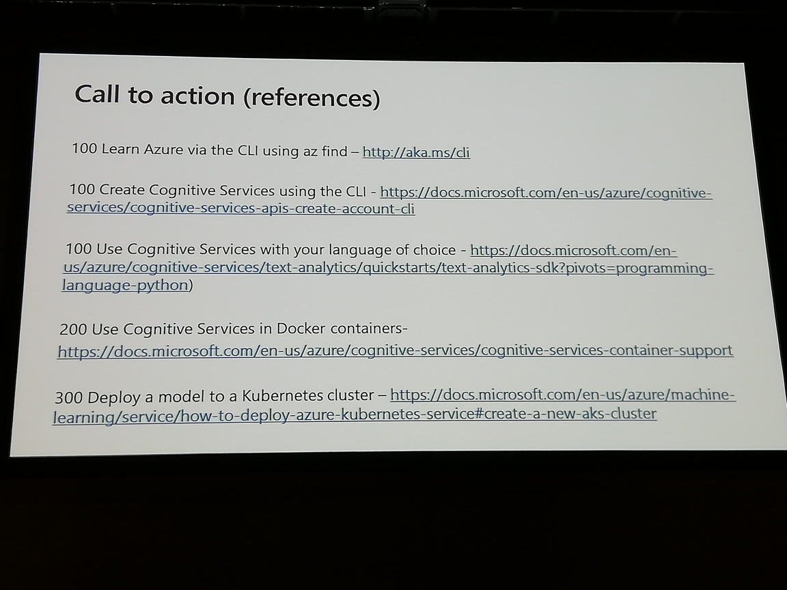
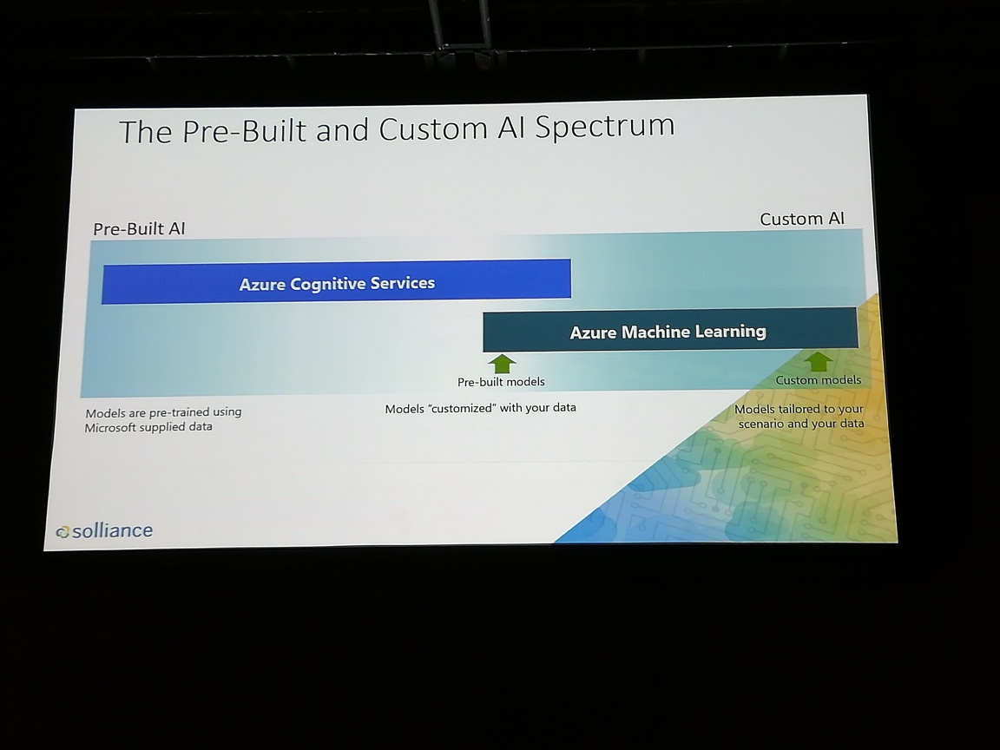

# AI zero to hero
prepare data -> build/train -> deploy

## Which:
	- features?
	- algorithm?
	- parameters?
^ time consuming / repetitive
simplify it!

azure machine learning "did the dirty work" with hyperparameters
	azure can apply a lot of resources to the problem (how much??)

## use case: credit card fraud (interesting!)
column name: "fraud or not?"
label column name: class (what we want to predict)
### settings: 
- end early when good match found
- max run time: 10 minutes

data can come from a CSV

Azure will try different models
"guard rails" - check that data is in the correct format

The developer without familiarity with ML can leverage AutomatedML SDK

MS doesn't see the data (that can't be right)

## use case: how much energy demand for NYC in the next 48 hours?
data: historical usage

primary metric choices - need ML specific knowledge to even know which one to choose

cleaning data - AutomatedML needs to be able to at least have rows and columns already set up
	missing data is ok, and you can tell AutomatedML how to fill in missing data

how do we know how much it will cost?
	only "compute" will cost
	for learning purposes, do a POC on a smaller dataset
		couldn't you just do a POC locally?

see photo for Resources

question: how is this actually being used by enterprise customers?
sql -> azure data factory -> data pipeline (helps simplify model -> deployment process)
	gave a very general answer ... thought they would give some use cases

question: how is this actually being used by enterprise customers?
sql -> azure data factory -> data pipeline (helps simplify model -> deployment process)
	gave a very general answer ... thought they would give some use cases

prepare data -> build/train -> deploy

## Which:
        - features?
        - algorithm?
        - parameters?
^ time consuming / repetitive
simplify it!

azure machine learning "did the dirty work" with hyperparameters
        azure can apply a lot of resources to the problem (how much??)

## use case: credit card fraud (interesting!)
column name: "fraud or not?"
label column name: class (what we want to predict)
### settings:
- end early when good match found
- max run time: 10 minutes

data can come from a CSV

Azure will try different models
"guard rails" - check that data is in the correct format

The developer without familiarity with ML can leverage AutomatedML SDK

MS doesn't see the data (that can't be right)

## use case: how much energy demand for NYC in the next 48 hours?
data: historical usage

primary metric choices - need ML specific knowledge to even know which one to choose

cleaning data - AutomatedML needs to be able to at least have rows and columns already set up
        missing data is ok, and you can tell AutomatedML how to fill in missing data

how do we know how much it will cost?
        only "compute" will cost
        for learning purposes, do a POC on a smaller dataset
                couldn't you just do a POC locally?

see photo for Resources

question: how is this actually being used by enterprise customers?
sql -> azure data factory -> data pipeline (helps simplify model -> deployment process)
        gave a very general answer ... thought they would give some use cases

question: how is this actually being used by enterprise customers?
sql -> azure data factory -> data pipeline (helps simplify model -> deployment process)
        gave a very general answer ... thought they would give some use cases

 
