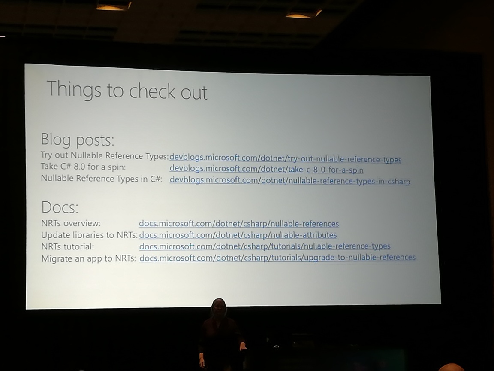

# C#8 what's new?

## Kathleen Dollard (very good speaker, easily best so far)

_static in a nested method prevents closing??_
  need to test ...
  
*C#8 only runs on .net core*
- only partially true
- but which feaures work/don't work complicated
  
# nullable reference types
  - in `csproj` add `<Nullable>true</Nullable>`
  _this will change the default re: nullability_
  - do it more selectively in code `#nullable enable`
  - When the default's changed to not nullable, add `?` to add an exception: _this type is allowed to be nullable_
  - None of this excuses you from null checking, though
  - `!` is the _null forgiving operator_ but considered a code smell ... aka _dammit, do what I said_ operator ...
  - There's a `!` attribute too? (or did they say annotation?)

# Asynchronous streams
  - watch the ignite video ...
  
# Default interface members
- very limited!
- can only be used in C#8 in .net core 3.0
- nothing else can use/consume it!!  

# Index / Range
- `var x = arr[..]; // get the entire array - useful with multi-diminsional arrays`

# Switch Expressions
  - need default or `_` when switching on enums
  _because you can put something not defined in the enums in a variable of enum type!!_
  - `_` works similarly to F# (pattern matching)
  - you can *not* `or` the conditions (unlike F#), and it *might* show up in C#9

check out toll collector app

see photo for resources

