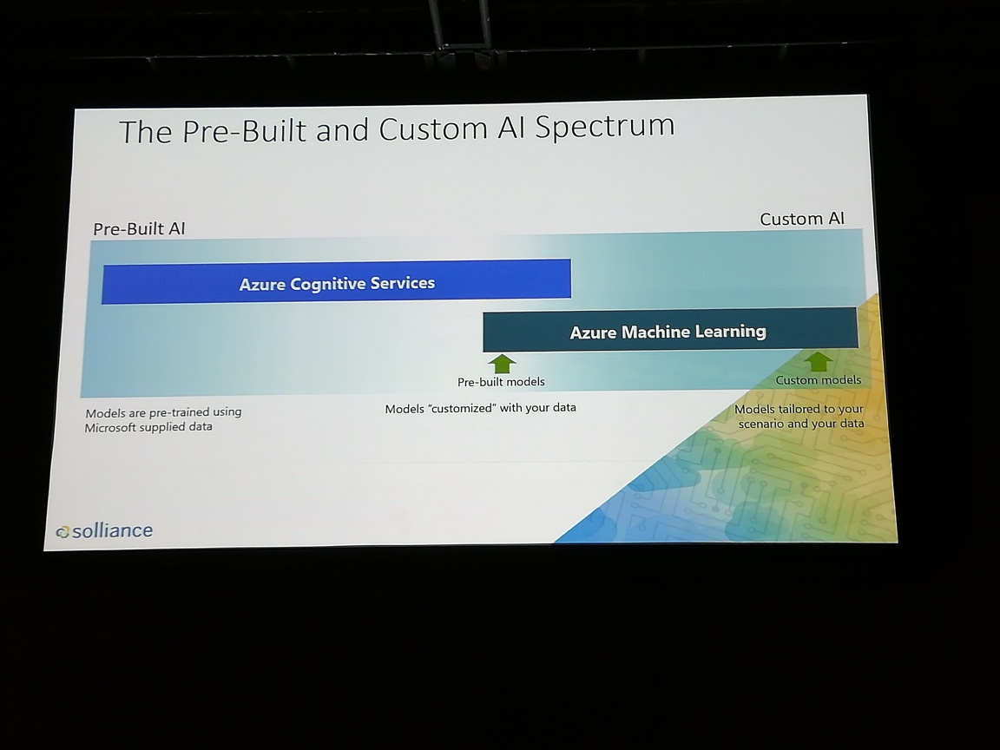
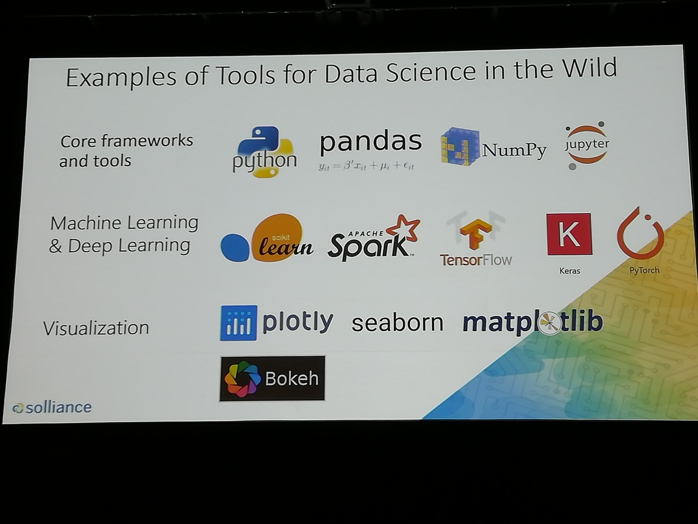
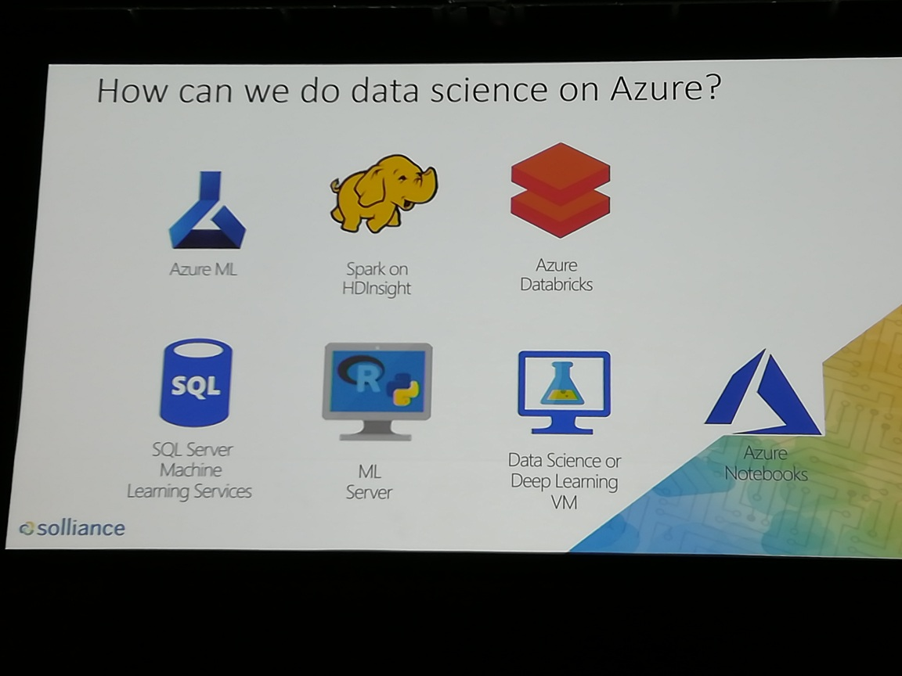
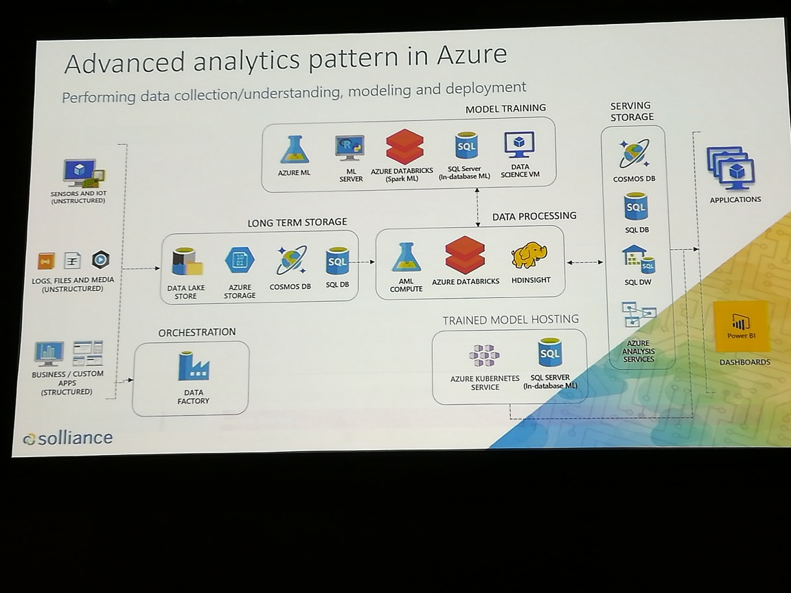
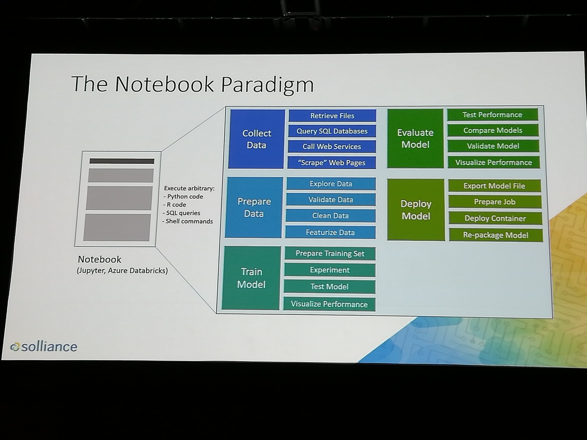
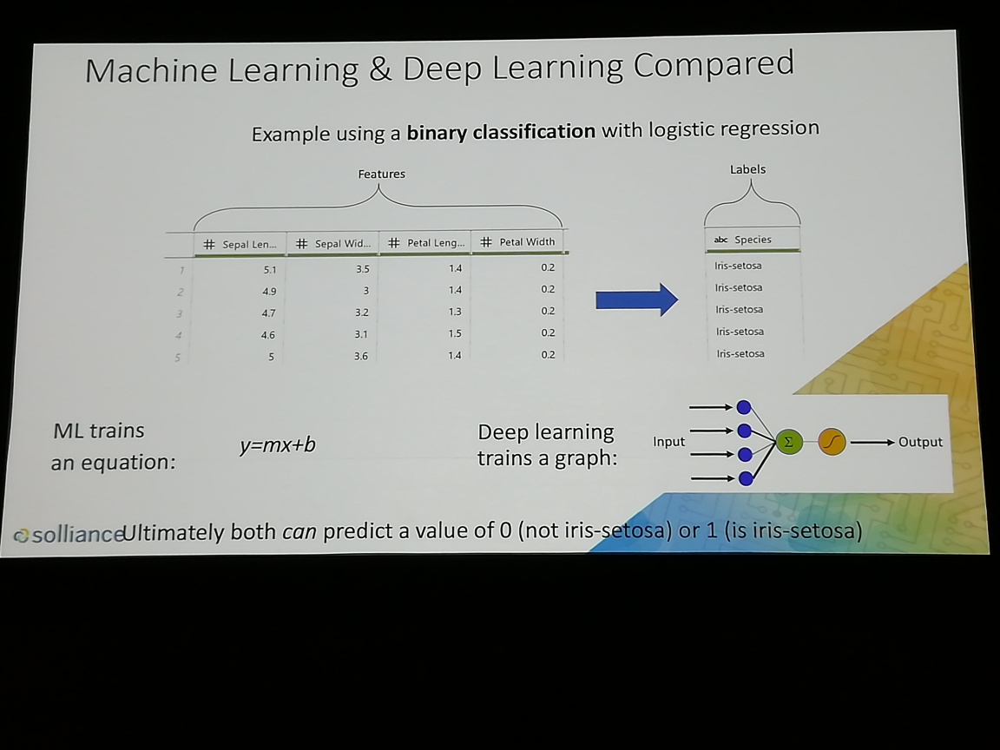
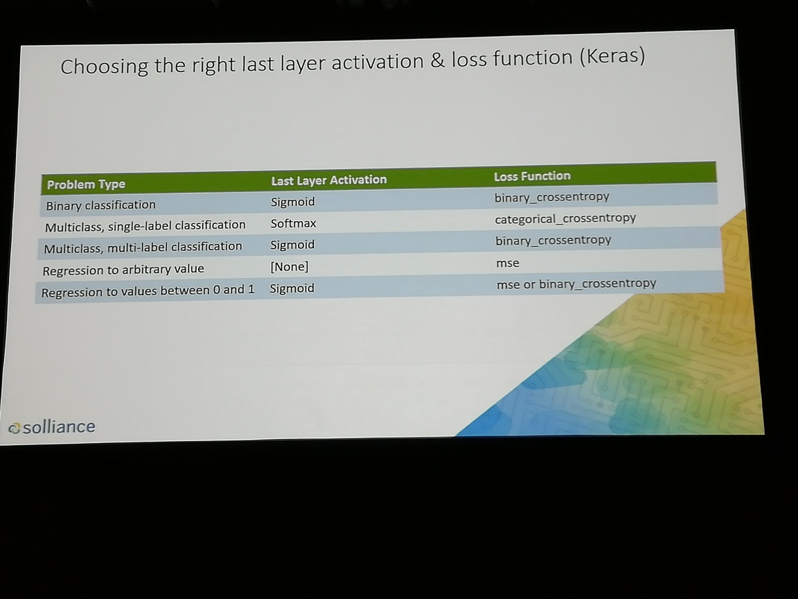

# Deep Learning for developers Part 1

ceo of solliance, author of several books
Zoiner Tejada

"don't know something? don't get scared, learn" - Ayn Rand (paraphrase)

## Fundamentals
history -> theory -> math -> concepts -> code -> best practices (bad approach)
bad because nobody uses anything besides the best practices
best practices -> concepts -> code -> (usually good enough), but can learn thoery, math, history later optionally

parsimonious model - just a simple one to try things out
	interative approach to build up to (complex) model

ML = computers can learn without being explicitly programmed

ML and DL both at high-level take data to determine meaning from input

Keras is some kind of library
	creator of Keras said ML/DL isn't so math-centric, more empirically oriented

DL will be yet another common tool such as web tech

resources: python, Azure Computer, Azure Storage (blobs, data lake), Azure ML
	what about ML.NET?

## data science process:
	1. collect data
	2. prepare data -> zoom in on which data is actually relevant
	3. train model -> analogous to homework that preps you for the quiz
	4. evaluate model -> based on metrics
	5. deploy model
	6. go back to "train model" (retrain model)

## data science process IN CODING TERMS:
	1. collect data - write code
	2. prepare data - write queries and code
	3. train model - write code, do some math
	4. evaluate model - write code, do some math
	5. deploy model - devops

beware of model rot!
	- data changes (goes out of date, etc)

see photo for the pre-built and custom AI spectrum

see photo for examples of data science tools

keras is a "human friendly interface" for tensor flow
pytorch is from FB

see photo for Azure data science services

Azure ML and Azure Databricks

see photo for advanced analytics pattern in Azure 

see photo for the notebook paradigm (how work in Jupyter or Databricks is organized)

## Demo 1
- login to Azure Databricks
	Databricks are a type of notebook
	notebook code snippets are executed remotely
	you can bring in something like d3.js!

	the cells are not linear - but everything is linked ... think spreadsheet formulas

spark data frames (df)
pandas data frames (pdf)

### DL applications
- language translation
- image recognition
- speech recognition
- forecasting
- predictive analytics
- autonomous vehicles

iris setosis is a hello, world dataset
see photo for ML/DL comparison

ML - a human decides on which features to train on
DL - automatic feature extraction; figures out features in a layered fashion (different levels of detail), massive amounts of training data, raw + unstructured OK (that's why it works with things like speech) - requires a lot of computing power

epoch - complete pass through training data
learning rate - adjust steps
activation function - example: ReLU (ray-luh) ... these make things non-linear
Regularization - aka "generalization" so the algorithm can work with more than just the training data
first few epochs are likely wrong (since they're random)

more key terms:
forward pass, backward pass, neurons, weight

(test) loss - is this low enough for us to accept the model?
see photo for types of functions (part of DL architecture)

training set vs test set (homework vs test)

overfitting - model is too close to the data it's been given (like memorizing the answers)
	Regularization, (much) more data, or simplification are all different techniques that might help
	
## demo 2 basic concepts of neural networks

