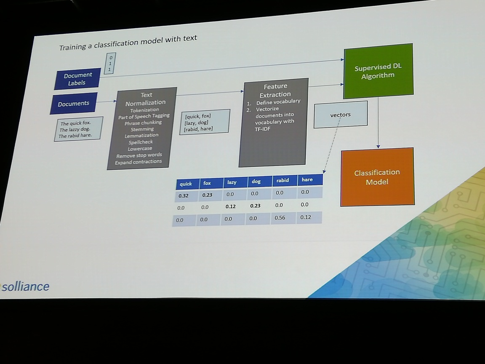
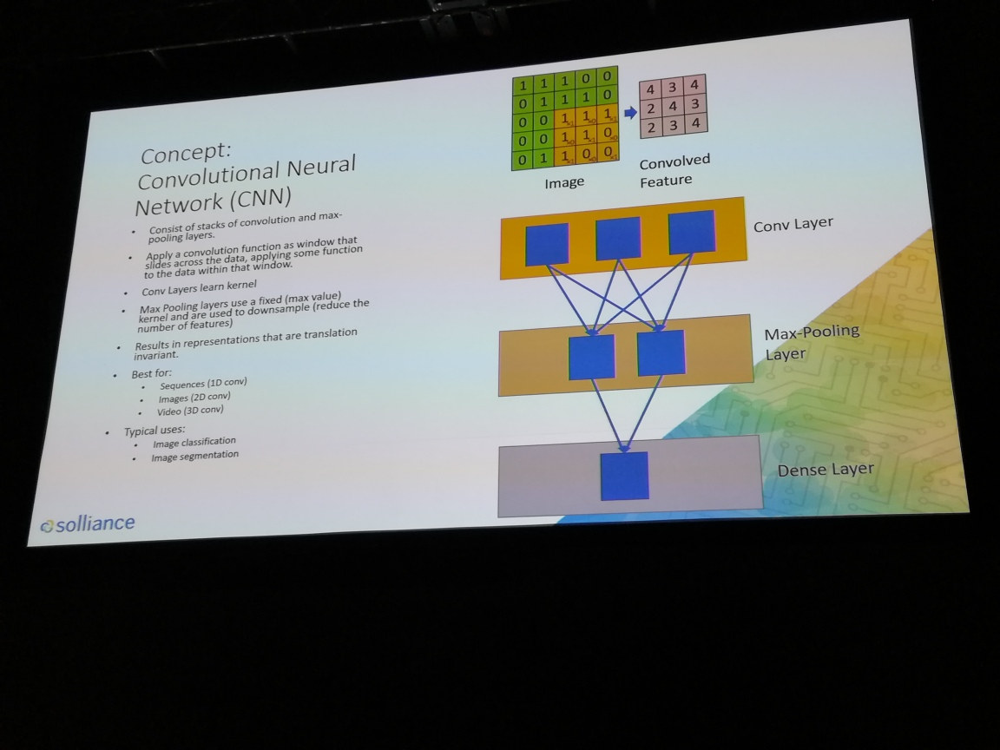
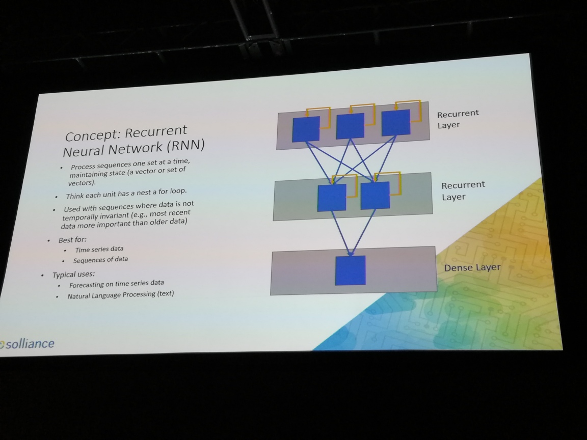
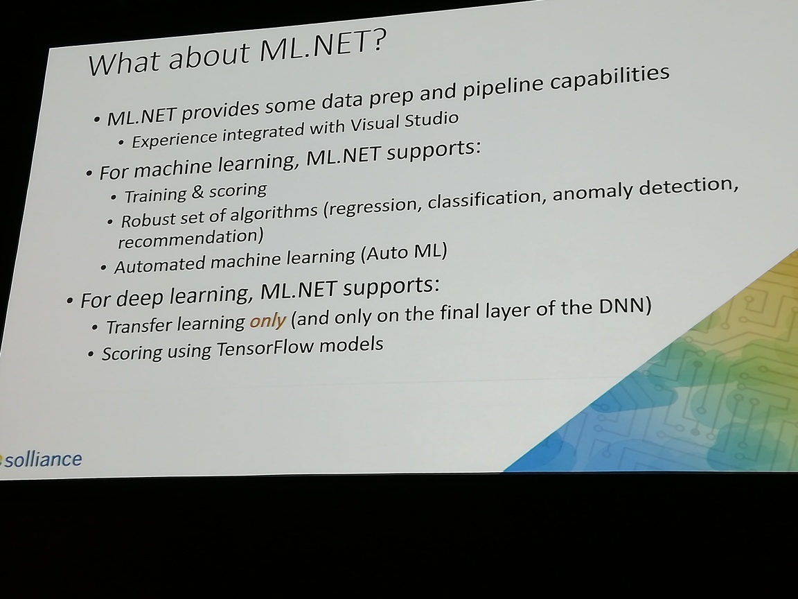

# Deep Learning for developers Part 2

## Practical neural network architectures

*neuron* == "unit"

*loss* == delta btw predictions and targets

Concept: Densely Connected Network
DNN
	uses
	- classification
	- regression
	notes
	good starter (parsimonious)

*stop words* == a, an, the
see photo for training a classification model with text
	the green box is the model (?)

neurons keep reducing in number at each level until 1 is left

## Demo 3 Azure ML to classify text (end to end example)

Solliance will give you an environment to play with

Automated ML (AutoML)

you can wrap models up into flask basked packages which can be run in docker containers
	flask is a micro web f/w written in python

GloVe embeddings from Stanford

word embedding matrix
	the matrix is a 3D space
	the words all have coordinates within the matrix (so?)
	the matrix has 100 coordinates
		why 100? bc a limit was put at 100 for the number of tokens

convert the Keras model to ONNX 
	- more portability
	- just need the ONNX runtime (no Keras, no Tensorflow)

at the end, publish to web

Concept: Convolutional Neural Network
see photo for CNN

demo goal: image search

*max pooling* - divide into 4 quadrants, take max value from each 
MSINST - "hello, world" of alphanumeric recognition
	train with images of sweaters, shoes, etc
	test with all kinds of images
	get back more sweaters

## Demo 5 recurrent neural network
see photo for RNN

the architecture has an impact on the result - some fit better with different analyses than others

what about ML.net?
see photo

some support for DL too!
	but can't do an end to end model ... but can work on the last few layers

contact solliance to do the lab:
zoinertejada@solliance.net
