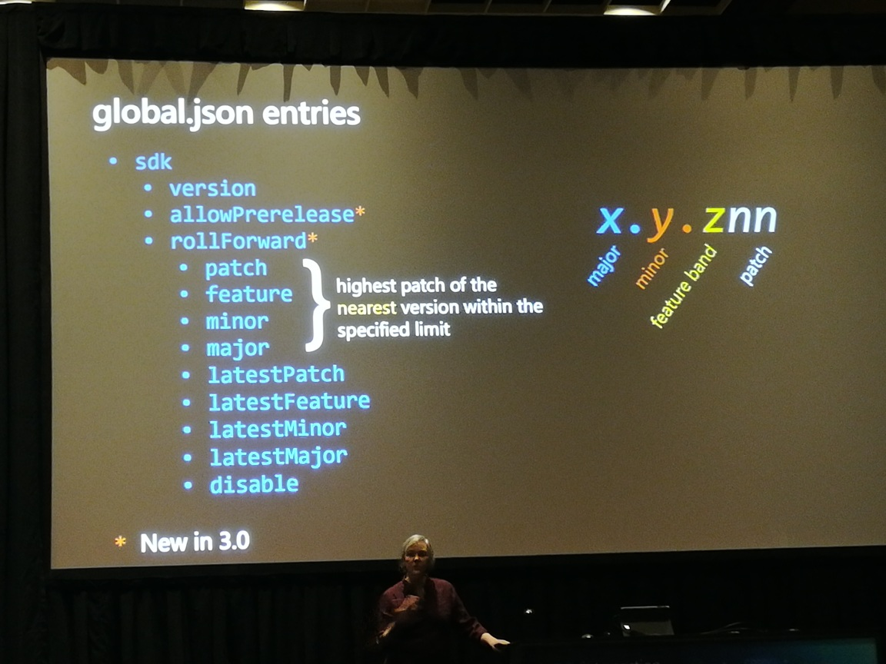
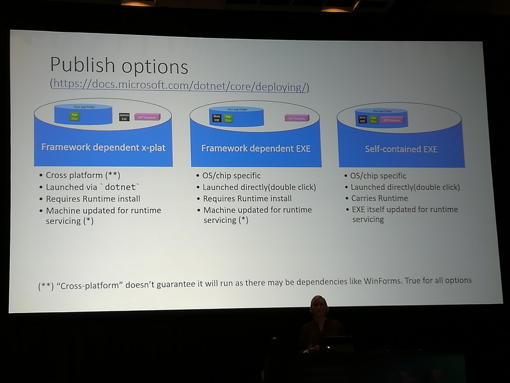

# .NET Core
_with Kathleen Dollard_

.NET 4.8 is on the Windows support policy and will be supported for a very long time
MS also has a huge number of .NET assets

Each SDK builds apps for earlier runtimes

# SDK selection

"Bootstrapper" selects an SDK (latest by default)
global.json can override the default
create with `dotnet new globaljson`
put in sln or repo root

## SDK version numbers
x.y.znn
x=major
y=minor
z=feature band
nn=patch

This is *not* semantic versioning

version numbers don't match "latest"

baseline SDK separate from VS

### splitting the SDK and runtime
- SDK patches rare
- runtime patches more frequent

`dotnet --list-sdks`
This might be useful for troubleshooting...

There is a tool to purge patches, etc

see photo for global.json entries
`allowPrerelease` surprising

nuget versioning uses *
_but complicated_

`System.Runtime.InteropServices.Runtime`
_not sure if the above is right_

# trimming
- new in 3.0
- =<PublishTrimmed>=

# Publish Options
See photo for Publish Options

# Tab completion
`dotnet add <TAB>`
_pretty smart!_
## .net core tab completion
_tells you how to enable tab completion for cli_
