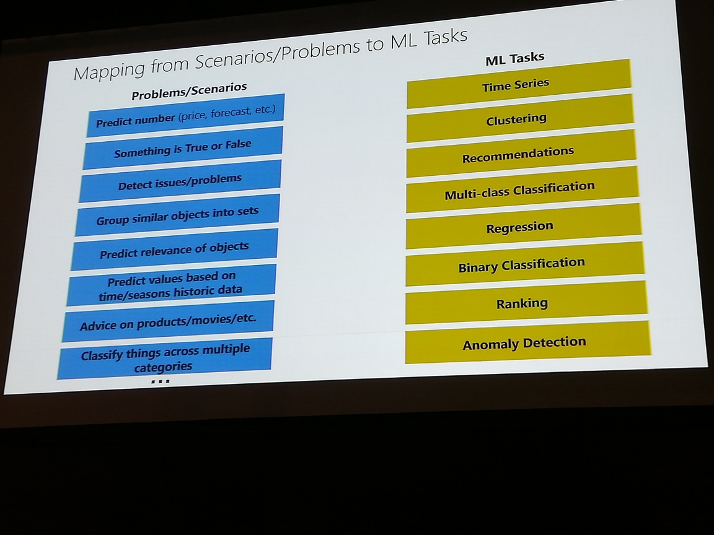

# ML.NET
# what would be good ML projects or use cases? <- my own question

ML.NET used internally for >8 years (bing ads, office, etc)

# new features:
- DNN
- db loader
- Jupyter
- see https://aka.ms/mlnet14blogpost

Supervised ML (infers label)
Unsupervised ML (infers ...)

https://github.com/dotnet/machinelearning-samples <-- lots of scenarios

see photo for mapping scenarios/problems to ML tasks

model creation + model consumption

demo solution with training console app and testing console app

model a zip file (what's in it!?!)

demo shows how the model is executed while typing to detect sentiment based on words.

"model builder" (tool in preview used inside VS)

API and CLI also do the same thing as "model builder"

## random thought
- prolog can come to conclusions based on a database of facts
- AI makes predictions, but accuracy is analogous to weather forecasting
- Are expectations for AI better suited for prolog?

posh> mlnet <parameters> <-- calculates model and saves it

XPlot package for plotting data

## DL features
- DNN
- Computer Vision
- Supports ONNX and Tensorflow (pytorch on roadmap)
lots of pre-trained models available
        but classifiers might not be what YOU want
                model uses "dog" but not what kind of dog

object detection
        also have free pre-trained models
        training for object detection coming in future versions

sample photo with a lot of cats didn't identify all of the cats ...

talk would make a great insomnia treatment

IDataView is used for both training and testing data

ml.net helps with memory load - it won't load a bunch of images into memory all at once - images are loaded as needed

task mgr actually shows gpu usage! :)

create model, consume model
wtf is a model exactly?!?

https://aka.ms/mlnetyoutube <-- ML youtube playlist
 
